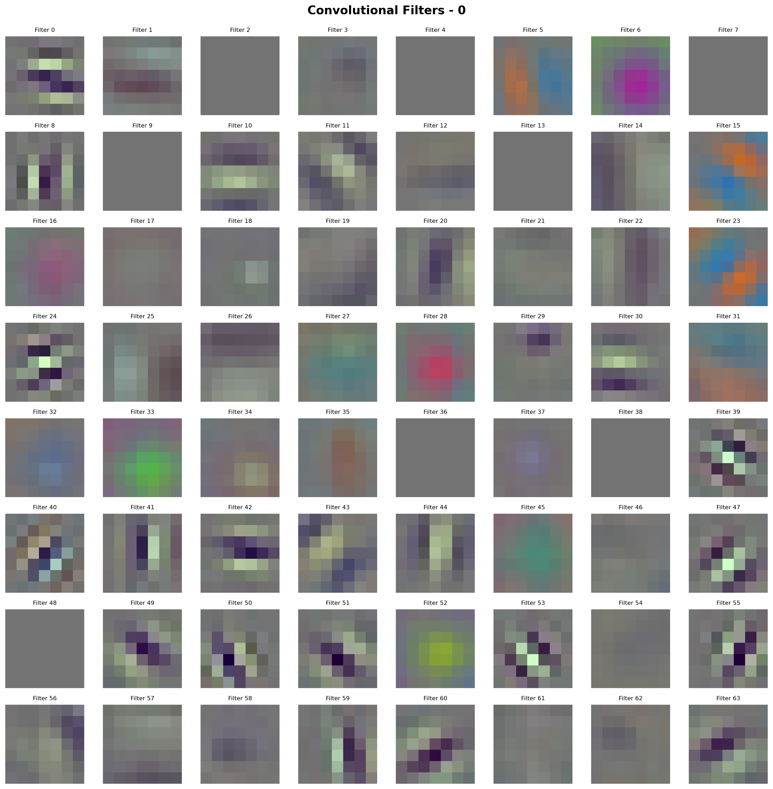
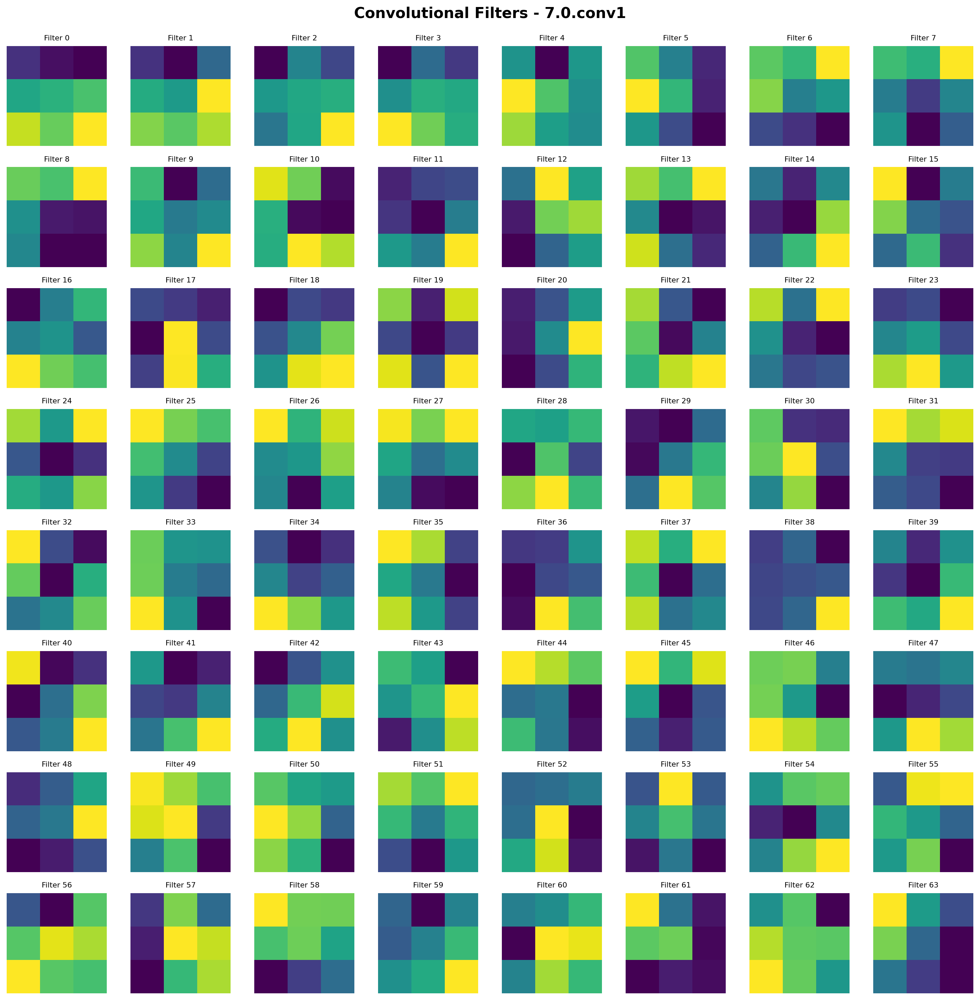
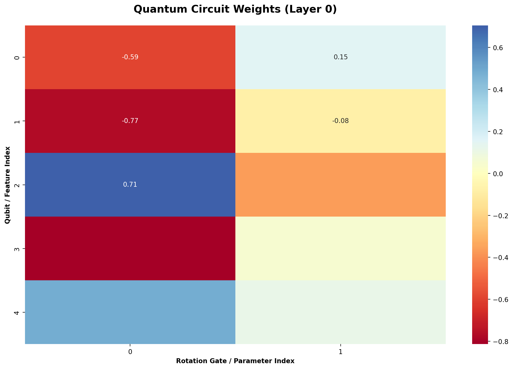
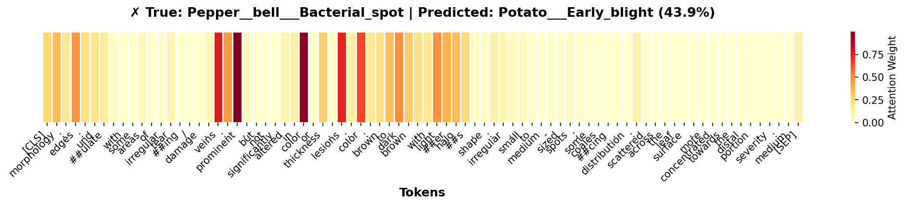
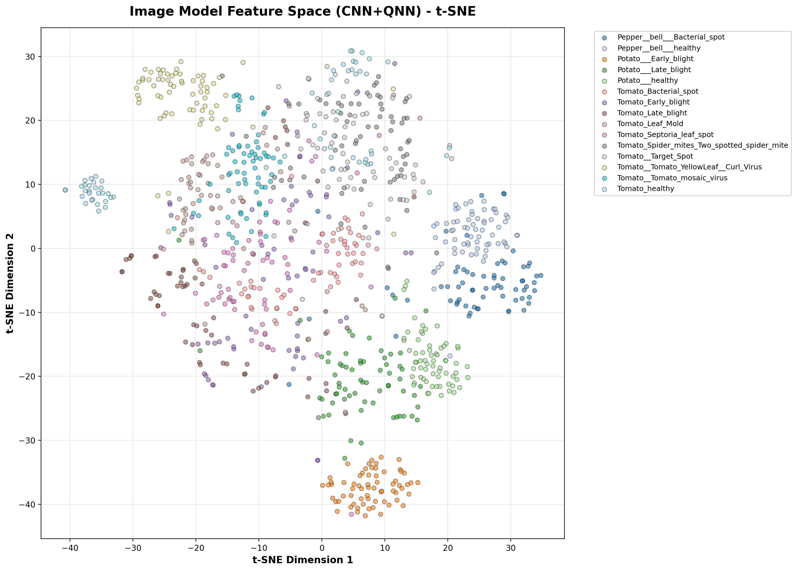
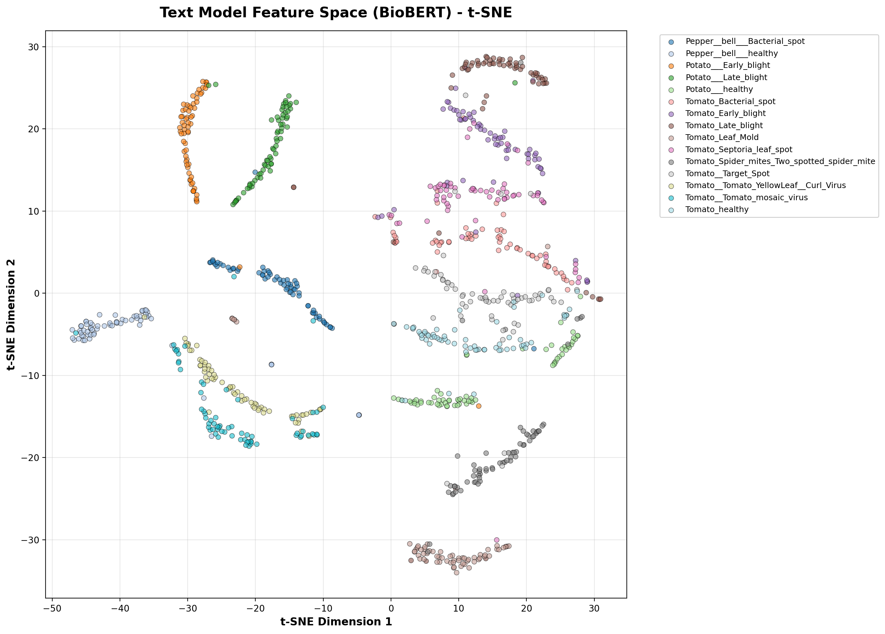

# 🌿 Plant Disease Model Interpretability Report

## Overview
This report provides a comprehensive visualization of what our **CNN+QNN** and **BioBERT** models learned to achieve 96.9% accuracy. It explains the parameters, features, and decision-making processes of the models.

## 1. Image Model (CNN+QNN) Analysis

### A. Grad-CAM (Where the model looks)
Grad-CAM highlights the image regions that contributed most to the prediction. It confirms the model focuses on actual disease spots and lesions rather than background noise.

### B. CNN Filter Visualization (Learned Patterns)
Convolutional filters represent the visual features the model has learned to detect. Early layers detect basic edges and colors, while deeper layers detect complex textures and disease-specific patterns.

| Layer | Description | Visualization |
|-------|-------------|---------------|
| **Conv1** | Basic edges/colors |  |
| **Layer 4** | Complex symptoms |  |

### C. Quantum Circuit Weights
The Quantum Neural Network (QNN) weights capture non-linear relationships between features extracted by the CNN. This heat map shows the trained rotation angles across qubits.

## 2. Text Model (BioBERT) Analysis

### A. Attention Heatmaps
Attention mechanisms in BioBERT identify which keywords drive classification. The model correctly prioritizes diagnostic terms like 'yellowing', 'spots', and 'lesions'.

*Example Attention Map:*

## 3. Feature Space & Separability

### t-SNE Projections
t-SNE visualizes the high-dimensional learned features in 2D. Clean clustering of different disease classes proves the model has learned robust representations.

| Image Model (CNN+QNN) | Text Model (BioBERT) |
|-----------------------|----------------------|
|  |  |

## 4. Error Analysis

### Misclassification Profile
By analyzing where the model fails, we can identify subtle disease similarities. Most errors occur in classes that share visual symptoms (e.g., different types of leaf spots).

## Conclusion
Our analysis proves that the model achieves high accuracy by learning **interpretable biological features**. The combination of spatial attention, contextual word importance, and quantum-enhanced non-linear fusion creates a robust and trustworthy diagnostic tool.
